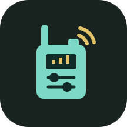

# Baofeng Programmer

**Your radio. Your settings. No account required.**

A simple Android Bluetooth programmer for the **Baofeng UV-5R Mini**, focused on analog memories and radio settings. Everything stays on your phone: no sign-in, subscription, cloud service, analytics, or Internet permission.

[Download version 1.0](https://github.com/dylanmaniatakes/Baofeng-Program/releases/tag/v1.0)

## Features

- Read and edit all 999 memory slots, with search and an option to show empty slots.
- Set channel names, receive/transmit frequencies, transmit inhibit, independent CTCSS/DCS tones, power, bandwidth, scan inclusion, and busy-channel lockout.
- Edit PTT ID, signaling group, receive DTMF, and frequency hopping.
- Program radio settings such as squelch, dual watch, scanning, VOX, timeouts, voice language, display options, and keypad lock.
- Choose system, light, or dark appearance.
- Keep local edits between sessions, review changes before writing, and export or restore backups.
- Check affected blocks before writing and verify every write by reading it back.

## Supported Radios

| Radio | Connection | Status |
| --- | --- | --- |
| Baofeng UV-5R Mini | Bluetooth LE | Reads, memory writes, and radio-setting writes tested on physical hardware |

Android 8.0 or later is required. Live testing used a Pixel 10 Pro. Compatibility with every firmware version or Android device is not guaranteed.

Other models and USB programming cables are planned, but **not supported in 1.0**. The app focuses on analog programming; DMR codeplugs are out of scope. New frequency entry covers the Mini's FM bands. Airband AM entry, VFO frequency editing, and DTMF code-sequence editing are not available. Existing unedited data is preserved.

## Install

1. Download `Baofeng-Programmer-1.0.apk` from [Releases](https://github.com/dylanmaniatakes/Baofeng-Program/releases/latest).
2. Open it on your Android device and allow installation from that source when prompted.
3. Open **Baofeng Programmer** and grant Bluetooth and location permissions for radio discovery.

## Program Your Radio

1. Turn on Bluetooth on the phone and radio.
2. Scan in the **Radio** tab and connect to the Mini, normally named **walkie talkie**.
3. Tap **Read radio**. The complete original image is backed up before editing becomes available.
4. Edit **Memories** or **Radio settings**. Enable **Show empty** to add a channel. Changes stay local until you write them.
5. Tap **Write**, review the changes, and confirm. Keep the radio powered on and nearby until verification finishes.

The overflow menu includes appearance, backup export/restore, and discarding local changes. Restore applies memories and supported settings to an already-read radio; it does not transplant another radio's calibration or unknown data.

## Backups And Recovery

Automatic backups are stored privately on the phone. Export important originals as `.bfp` files before uninstalling or clearing app data. Exported files contain your radio programming.

If a transfer fails, reconnect and read the radio again before writing. A multi-block write is not atomic and an interruption can leave a partially updated radio. The app retains the original and pre-write backups and does not report a write as successful until read-back verification completes.

Existing non-ASCII channel names are preserved unless edited; new names use printable English letters, numbers, and punctuation, up to 12 characters. Unsupported tone values are preserved when unchanged. A restore can reject unsupported edited values rather than guess a conversion.

## Build And Test

Use Android Studio, or an Android SDK with platform 35 and JDK 17 or 21:

```sh
cd Android
./gradlew :app:assembleDebug :radio-core:test :app:lintDebug
```

The debug APK is created in `Android/app/build/outputs/apk/debug/`. See [release builds](docs/BUILDING.md) for signing your own APK.

The project separates the Compose app, Bluetooth transport, and pure Kotlin radio core. USB support can be added through the transport interface without putting USB-specific code in the memory editor.

Tests cover memory and setting codecs, backups, fragmented replies, incorrect identities, changed radio data, rejected writes, and corrupted read-back data. Optional local-image validation is available with `-PradioBackup=/absolute/path/to/original.bfp`; personal images are not included in the repository.

## Reporting Problems

Include your radio model and firmware, phone model, Android version, the operation you attempted, and the exact error. Avoid posting private backups or unrelated phone logs. Testing additional devices and improving the interface are welcome contributions.

This is an independent project, not an official Baofeng application. Use only frequencies and transmit settings you are authorized to operate.

## License

[MIT](LICENSE)
